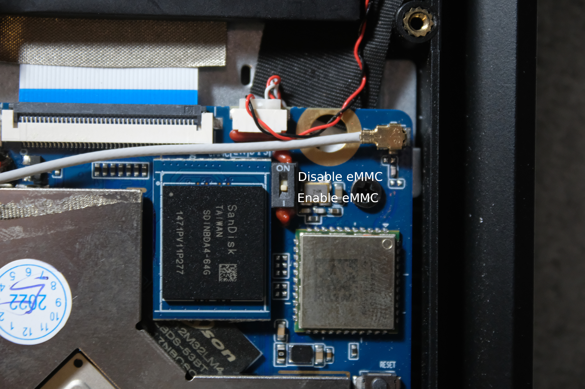
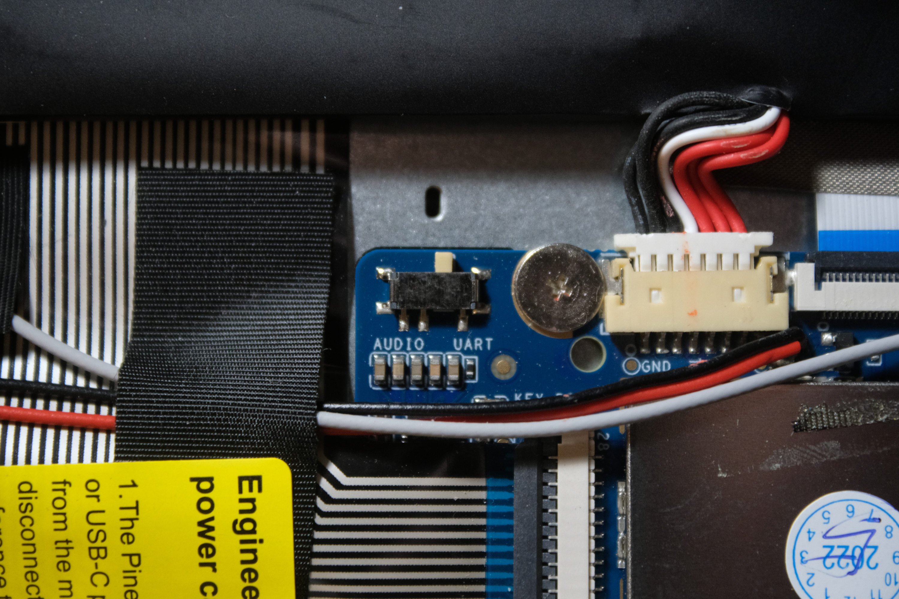

This is a very small bootable 'thing' that can run on the Pinebook Pro. From bare metal, it will initialize and
power up everything needed to get the 1080p eDP display working. Feel fee to tinker with it.

Usage:
- Disable eMMC
- Plug in device with USB-C (as if it were a camera or phone)
- Install [xrock](https://github.com/xboot/xrock)
- `make`

You can also make the `pine.img` target to compile a SD card bootable image.

eMMC ON/OFF DIP switch:

Audio out / UART serial DIP switch:

For more questions: daniel@futo.org
Copyright (C) FUTO 2023-2024  
