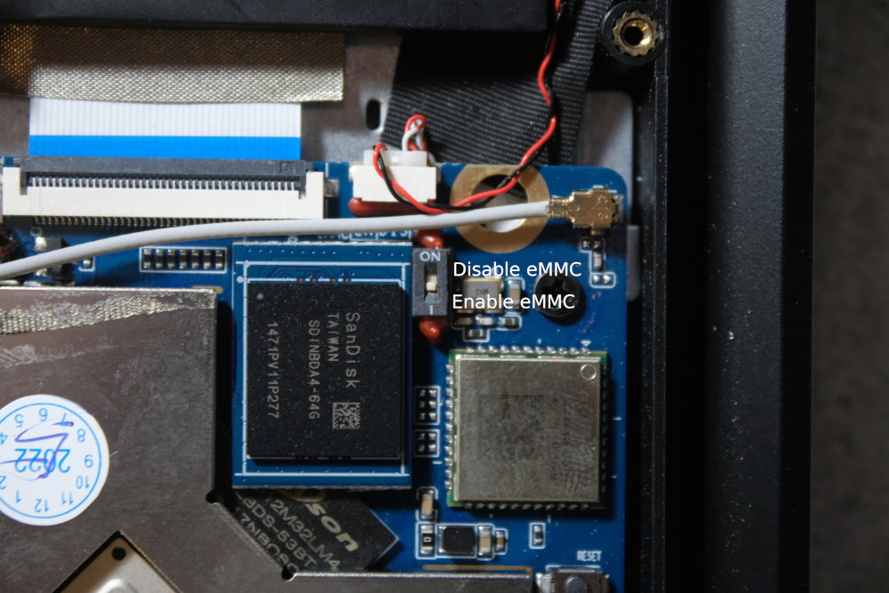

# Pinebook Pro

# Getting USB-OTG boot working
- Erase anyting installed on SPI flash
- Disable eMMC
- Press power button for 1-2 seconds
- Device with `idVendor=2207, idProduct=330c` should be connected

### eMMC DIP switch

